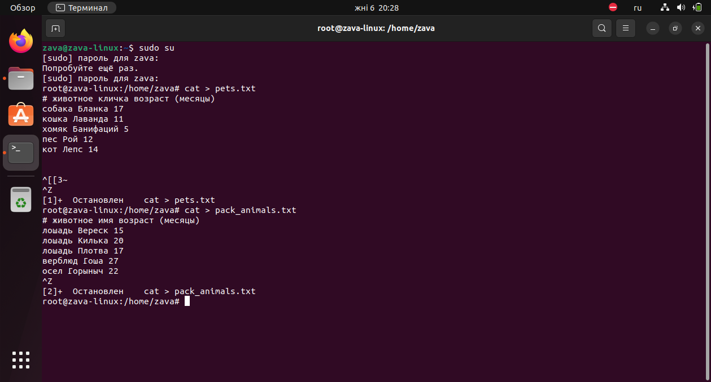
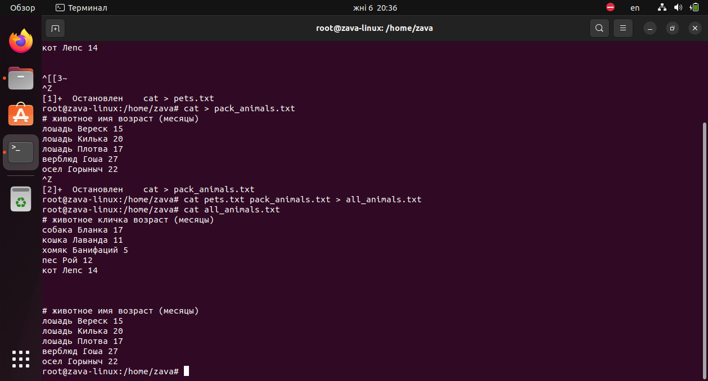
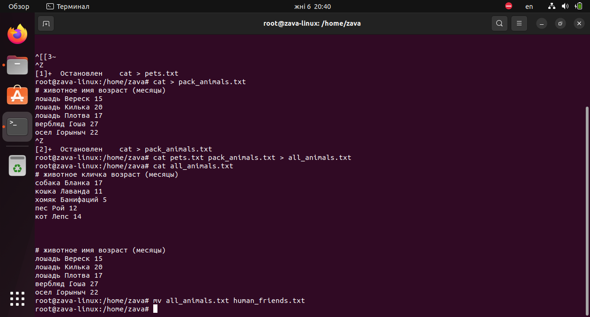

**Итоговая аттестация**
*Организуйте систему учёта для питомника, в котором живут домашние и вьючные животные.*

1.С помощью команды -cat- в терминале операционной системы Linux, создали два файла Домашние животные (заполнив файл собаками, кошками, хомяками) и Вьючные животными заполнив файл лошадьми, верблюдами и ослы), а затем объединить их.
    $ cat > pets.txt
    $ cat > pack_animals.txt
    $ cat pets.txt pack_animals.txt > all_animals.txt

Просмотреть содержимое созданного файла. Переименовать файл, дав ему новое имя (Друзья человека).

    $ cat all_animals.txt
    $ mv all_animals.txt human_friends.txt

