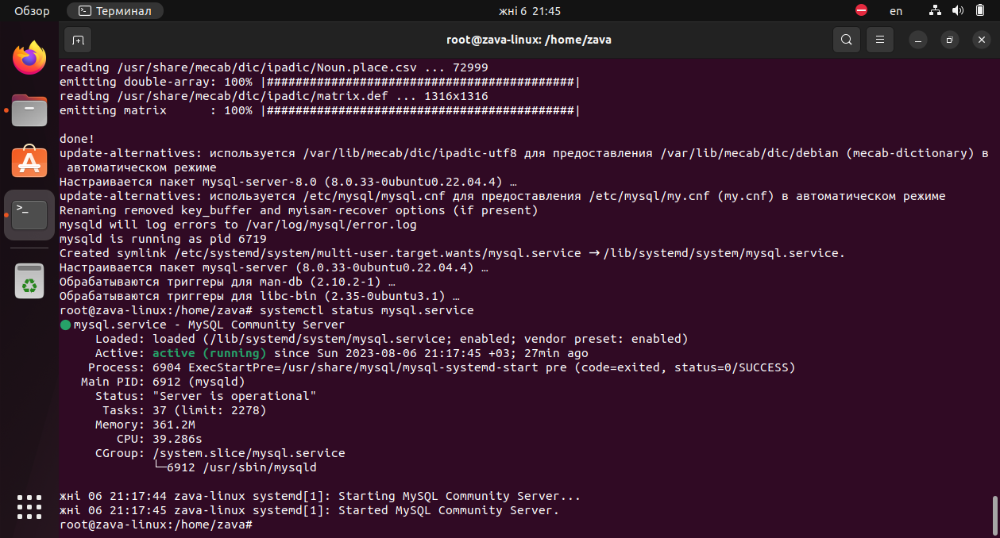

**Итоговая аттестация**
*Организуйте систему учёта для питомника, в котором живут домашние и вьючные животные.*

1.С помощью команды -cat- в терминале операционной системы Linux, создали два файла Домашние животные (заполнив файл собаками, кошками, хомяками) и Вьючные животными заполнив файл лошадьми, верблюдами и ослы), а затем объединить их.
    $ cat > pets.txt
    $ cat > pack_animals.txt
    $ cat pets.txt pack_animals.txt > all_animals.txt

Просмотреть содержимое созданного файла. Переименовать файл, дав ему новое имя (Друзья человека).

    $ cat all_animals.txt
    $ mv all_animals.txt human_friends.txt

2.Создать директорию, переместить файл туда

    $ mkdir animal
    $ mv human_friends.txt animal/

 

3.Подключить дополнительный репозиторий MySQL. Установить любой пакет из этого репозитория.
    $ sudo dpkg -i mysql-apt-config_0.8.24-1_all.deb
    $ sudo apt update 

 
    $ sudo apt install mysql-server mysql-client
    $ systemctl status mysql.service

 
 

4.Установить и удалить deb-пакет с помощью dpkg.

   $ sudo dpkg -i mysql-apt-config_0.8.24-1_all.deb
   $ sudo dpkg -r mysql-apt-config
   $ sudo dpkg --purge mysql-apt-config

5.Нарисовали диаграмму, в которой есть класс родительский класс, домашние животные и вьючные животные, в составы которых в случае домашних животных войдут классы: собаки, кошки, хомяки, а в класс вьючные животные войдут: лошади, верблюды и ослы.
Диаграмма классов -

6.В MySQL репозитории создать базу данных “Друзья человека”
